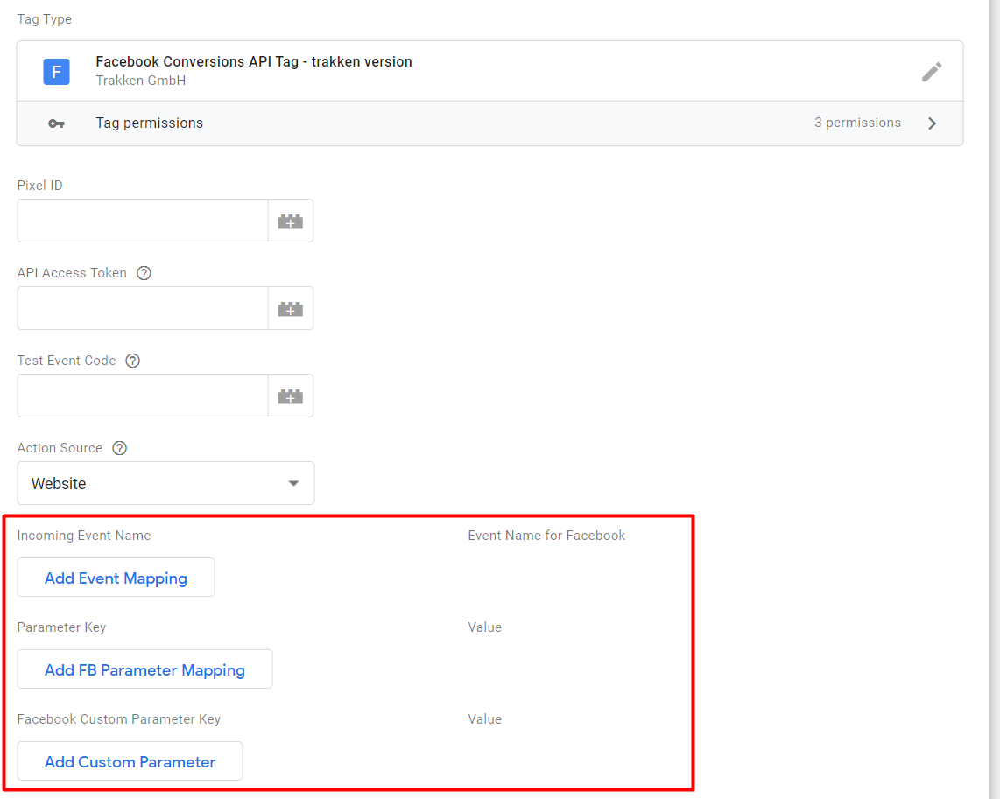

# Meta/Facebook CAPI Tag — TRKKN version

Send server-side events from Google Tag Manager to the Meta Conversions API (CAPI), with flexible event and parameter mappings, privacy controls, multi-pixel support, and optional event enhancement.

This community template is based on Meta's official Conversions API tag template and extends it for more flexible server-side tracking implementations.

## Notice

When running the tests, you may encounter the following error:

This appears to be a bug within sGTM. Fortunately, you can resolve it with this quick workaround:

1. Run a single test successfully.
2. Delete that specific test.
3. Proceed to run all remaining tests (they should now execute without issue).

## Enhanced Features

Why to choose this template?
We've improved the original Facebook template to offer greater flexibility in implementing Facebook tracking. Here are the key updates:

1. **IP Anonymization**  
   Added an option to anonymize IP addresses for enhanced privacy compliance.

2. **Event Data Mapping**  
   Introduced mapping capabilities for event data names, allowing you to send data without strict adherence to Facebook's naming conventions. This is particularly useful if you aim to avoid duplicating event parameters across platforms.

3. **Control Over Personal Data**  
   Added a feature to **choose** whether personal data, such as email addresses, is sent to Facebook. By default, Facebook would extract such data if found in event parameters.

4. **Automatic Hashed Email Retrieval**  
   Now automatically retrieves hashed email data from Google Ads/Floodlight event parameters, streamlining cross-platform tracking.

5. **Support** for TRKKNs Facebook repost logic

These enhancements make the TRRKN-Version of the Facebook tag more adaptable and privacy-conscious, aligning with modern tracking needs.

[Improved CAPI template](https://tagmanager.google.com/gallery/#/owners/trkkn/templates/GTM-Server-Tag-Facebook-TRRKN-Version) for server side Tag Manager in official template gallery.

